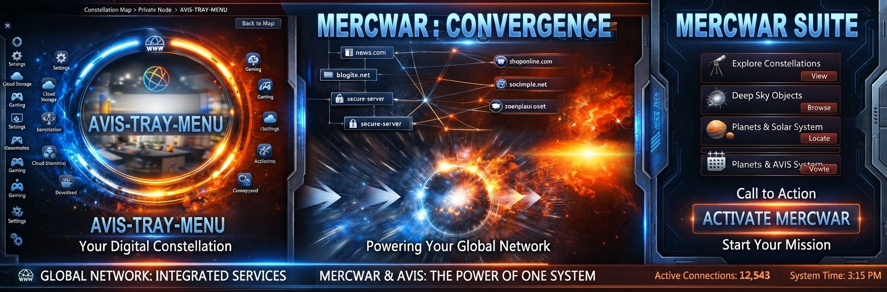
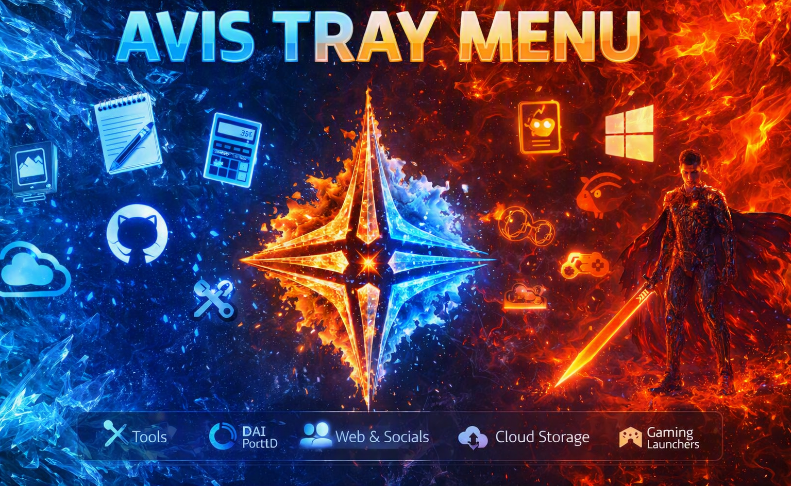

<a target="_self" title="CLICK HERE to ENTER the GATEWAY FREE!" href="https://mercwar.github.io/Constellation/index.html">

</a>


## ✨ Mercwar AVIS Tray Menu




## 📌 Overview
AVIS Tray Menu is a lightweight Windows utility that places a custom icon in your system tray. Clicking the icon opens a menu of shortcuts defined in a simple JSON file. You can organize tools, apps, websites, and system utilities into submenus, all without editing the program itself.


---

## ⚙️ Features
- MSVC Open Source
- JSON‑driven configuration — no recompiling needed to change menus.
- Supports nested submenus for organization.
- Launches any executable, system tool, or URL.
- Tray icon with right‑click menu and exit option.
- Extendable: add internal functions by using special command IDs.


---

## 🖥️ What You’ll See
- A **tray icon** appears in the bottom‑right corner of your screen.  
- Right‑clicking the icon opens your custom menu.  
- Each item launches the program, tool, or website you defined.  
- At the bottom of the menu, you’ll always see an **Exit** option.  


---

<a target="_self" title="CLICK HERE to ENTER the GATEWAY FREE!" href="https://mercwar.github.io/Constellation/index.html">

</a>
"<i>I am CVBGOD, and I have given it to you</i>!"

## 📂 Step 1: Prepare the Source
Download or clone the source files:
- `avis_tray.c` (main program)
- `cJSON.c` and `cJSON.h` (JSON parser)
- `resource.h` and `avis_tray.rc` (tray icon resources)

Put them all in one folder, e.g. `C:\avis_tray`.

---

## 🛠️ Step 2: Compile the Program
You need Microsoft Visual Studio (Community edition is fine) or the MSVC build tools.

1. Open **Developer Command Prompt for VS**.  
2. Navigate to your folder:
   ```cmd
   cd C:\avis_tray
   ```
3. Compile:
   ```cmd
   cl avis_tray.c cJSON.c user32.lib shell32.lib comdlg32.lib
   ```
4. This produces `avis_tray.exe`.


---

## 📑 Step 3: Create Your JSON Menu
In the same folder, create a file called `menu.json`. This file defines your tray menu.

Example:

```json
{
  "items": [
    {
      "text": "Tools",
      "submenu": [
        { "text": "Notepad", "command": "notepad.exe" },
        { "text": "Calculator", "command": "calc.exe" },
        { "text": "Paint", "command": "mspaint.exe" }
      ]
    },
    {
      "text": "System",
      "submenu": [
        { "text": "Task Manager", "command": "taskmgr.exe" },
        { "text": "Device Manager", "command": "devmgmt.msc" }
      ]
    }
  ]
}
```

- **text**: The label shown in the menu.  
- **command**: The program or system tool to run.  
- **submenu**: A nested list of items.  


---

## ▶️ Step 4: Run the Program
1. Double‑click `avis_tray.exe`.  
2. A tray icon appears in the bottom‑right corner.  
3. Right‑click the icon to open your menu.  
4. Click any item to launch its command.  
5. Choose **Exit** at the bottom to close the program.  


---

## 🎨 Step 5: Customize the Tray Icon
The tray icon is defined in `avis_tray.rc` and `resource.h`. You can replace it with your own `.ico` file:

1. Put your icon file in the project folder.  
2. Update `avis_tray.rc` to reference it.  
3. Recompile.  


---

## 💡 Tips
- Escape backslashes in JSON (`\\`).  
- Use full paths for apps not in your PATH.  
- Validate your JSON with jsonlint.com if menus stop showing.  
- Organize with submenus to avoid clutter.  

---

## 👀 What Users Will Experience
- **First run**: A tray icon appears instantly.  
- **Right‑click**: A menu pops up with your categories (Tools, System, etc.).  
- **Selecting an item**: The chosen program launches immediately.  
- **Exit option**: Always available at the bottom of the menu.  


---

## 🚀 Conclusion
With AVIS Tray Menu, you can build a personalized launcher that lives in your system tray. All customization happens in `menu.json`, so you don’t need to touch the code once it’s compiled. Swap icons, add shortcuts, and organize your workflow exactly how you want.


---

## ⚖️ Legal Notice

### 📜 Copyright & License
AVIS Tray Menu © 2026 Demon (Tela Tran).  
All rights reserved unless otherwise stated.

This software is distributed for educational and personal use. You may compile, modify, and use the source code for your own projects, provided that:
- You retain this copyright notice in all copies or substantial portions of the software.
- You do not sell or redistribute the compiled binary without permission.

If you plan to publish modified versions or include AVIS Tray Menu in commercial software, please contact the author for written consent.

---

### 🧩 Third‑Party Components
This project uses **cJSON** for JSON parsing, which is licensed under the MIT License.  
All other trademarks, product names, and company names mentioned in the menu examples (e.g., Microsoft, GitHub, Discord) are property of their respective owners.

---

### 🔒 Disclaimer
This software is provided “as is,” without warranty of any kind, express or implied.  
The author assumes no responsibility for any damage, data loss, or system instability resulting from use or misuse of this program.

By compiling and running AVIS Tray Menu, you acknowledge that:
- You are responsible for verifying the safety of any commands or executables referenced in your `menu.json`.
- You understand that launching system utilities or third‑party applications through this menu is done at your own risk.

---

### 🧠 Intellectual Property
The **Fire & Ice icon** and **AVIS Tray Menu banner** are original AI‑generated artworks created for this project.  
They may be used freely for non‑commercial documentation, tutorials, and promotional materials related to AVIS Tray Menu.  
For commercial use, please request permission from the author.

---

### 🪪 Attribution
If you share or fork this project, please include the following attribution line in your README:

> Built with AVIS Tray Menu © 2026 Demon (Tela Tran)

